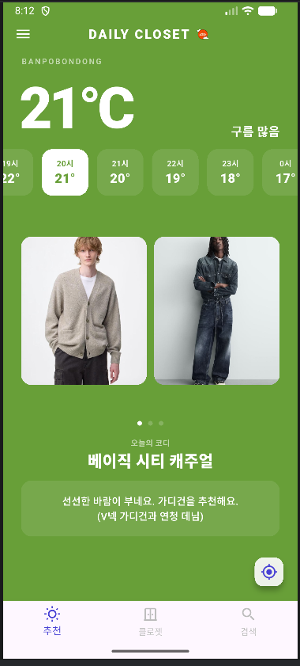
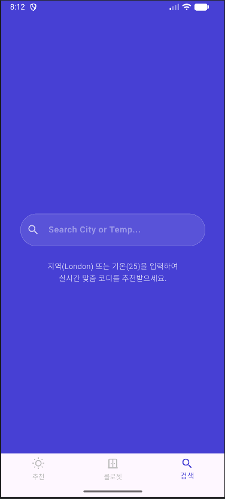
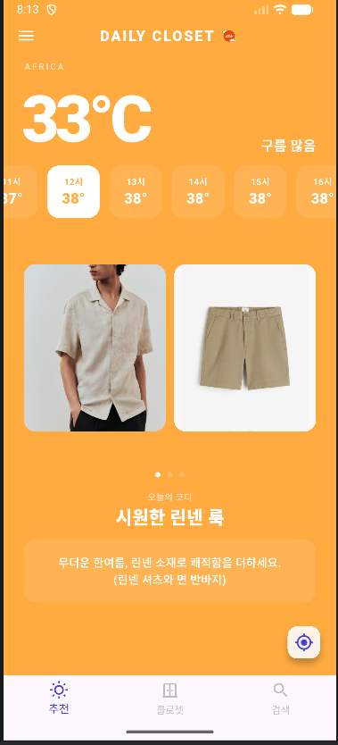
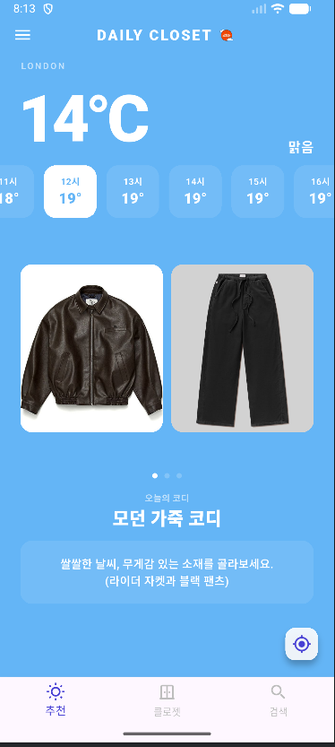
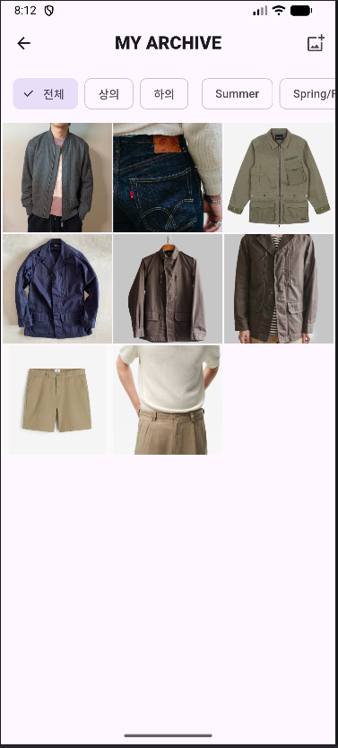

# ☁️ Daily Closet : 날씨별 퍼스널 패션 큐레이션 서비스
> [모바일프로그래밍 중간과제] 글로벌미디어학부 21학번 이철환

---

## 📝 프로그램 개요
***Daily Closet***은 실시간 기온 데이터를 기반으로  
사용자가 원하는 지역 및 시간대별 날씨에 맞는 최적의 옷차림을 제안하고, 
사용자의 개인 의류를 아카이빙하여 맞춤형 코디까지 제공하는 
**초개인화된 날씨별 패션 큐레이션 서비스**입니다. 

매일 아침 **"오늘 뭐 입지?"** 라는 고민을 해결하기 위해, 
단순한 날씨 정보 제공을 넘어 개인의 옷장을 기반으로 한 
**실용적인 코디 솔루션**을 제공합니다.

## 🚀 주요 기능 설명
* **📍 현 위치 기반 실시간 맞춤 코디:** 현재 사용자가 있는 위치의 GPS를 기반으로 기온을 분석하여, 지금 입기 가장 좋은 최적의 코디 가이드를 즉시 추천합니다.
* **🔍 지역 및 기온 검색 시뮬레이션:** 타 지역으로 이동하거나 특정 날씨를 대비할 때, 사용자가 직접 지역이나 기온을 검색하여 해당 조건에 맞는 옷차림을 미리 추천받을 수 있습니다.
* **🗂️ 마이 클로젯 (의류 아카이빙):** 사용자가 보유한 옷의 이미지를 계절별(봄/여름/가을/겨울) 및 종류별로 분류하여 나만의 디지털 옷장으로 체계적으로 아카이빙할 수 있습니다.
* **👕 내 옷장 기반 지능형 코디 추천:** '마이 클로젯'에 등록된 사용자의 실제 보유 의류 데이터를 기반으로, 현재 기온에 매칭되는 나만의 맞춤 코디를 큐레이션해 줍니다.

---

## 📸 실행 화면
   &nbsp;&nbsp;&nbsp;&nbsp;

<em>앱을 실행시키면 옷장문이 열리는 듯한 효과와 함께 메인 로고이미지가 떠오릅니다.</em>

## 📸 메인 화면

  
## 📸 검색화면

## 📸 지역별 검색결과 화면
<bold>🌍 글로벌 기온 검색 시뮬레이션</bold> 

&nbsp;&nbsp;&nbsp;&nbsp;

 
<em>(좌: 아프리카 코디 추천 / 우: 런던 코디 추천)</em>

## 📸 마이클로젯 탭 (내 옷 아카이브)

---

## 🛠 본인이 구현한 부분
* **위치 및 날씨 데이터 연동:** Geolocator를 활용한 실시간 위치 수신 및 날씨 API(OpenWeather 등) 통신과 JSON 데이터 파싱 로직 구현
* **코디 매칭 알고리즘:** 현재 기온, 혹은 검색된 기온 데이터를 분석하여 적절한 의류 카테고리를 분류하는 매칭 시스템 설계
* **의류 데이터 관리 구조 설계:** '마이 클로젯' 내 계절별 분류 및 데이터 아카이빙을 위한 UI/UX 기획 및 상태 관리
* **전체 앱 아키텍처 및 디자인:** 사용자 편의성을 고려한 직관적인 탭 기반 네비게이션 및 UI/UX 디자인, 로고디자인 (포토샵, Canva, Flutter 위젯 활용)

## 🤖 AI 활용 여부 및 범위
* **AI 활용 방식:** Vibe Coding을 적극 활용한 페어 프로그래밍
* **상세 활용 범위:** Gemini 모델을 활용하여 복잡한 API 데이터 파싱 및 UI 레이아웃 구성 단계에서 코드 초안을 작성하거나 디버깅하는 데 활용하여 개발 효율성을 높였습니다.

## ⚖️ 라이센스
Copyright 2026. 이철환(Chul-Hwan Lee) all rights reserved.
